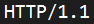
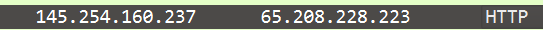
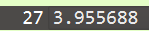

  <h1 style="text-align: center;font-weight: bold">Workshop Administrasi Jaringan</h1>
  <h4 style="text-align: center;">Dosen Pengampu : Dr. Ferry Astika Saputra, S.T., M.Sc.</h4>

 

  
   
   
  

    <strong>Muhammad Daffa Erfiansyah (3123500006)</strong> 
  

<h3 style="text-align: center;line-height: 1.5">Politeknik Elektronika Negeri Surabaya Departemen Teknik Informatika Dan Komputer Program Studi Teknik Informatika 2024/2025</h3>
  

## Review Konsep Jaringan

### 1. Analisa Versi HTTP, IP Address dari client maupun server, berapa durasi waktu dari client mengirimkan HTTP request hingga waktu dari server mengirimkan ke server.

### Jawaban

>Versi : HTTP/1.1 

>IP HTTP Client : 145.254.160.237 

>IP HTTP Server : 65.208.228.223

>Durasi HTTP Request : 0.911310 

>Durasi HTTP Response : 3.955688 

>Durasi waktu dalam 1 sesi HTTP Response : 4.846969 - 3.955688 = 0.891281

### 2. Deskripsikan gambar pada slide 3

Figure 23.1 Types of data deliveries slide PPT

### Deskripsi

  

1. Pada <b>Transport Layer</b>, komunikasi terjadi antara aplikasi di perangkat pengirim dan penerima. Data dikemas dalam segmen dengan header yang berisi port number, memastikan data sampai ke aplikasi yang tepat. Melibatkan protokol TCP dan UDP.
 
 
2. Pada <b>Network Layer</b>, data dikemas dalam bentuk paket dan dikirim dari komputer pengirim ke komputer penerima melalui internet. Melibatkan protokol IP Proses yang terjadi:
Pengalamatan IP → Setiap paket diberi alamat IP sumber dan tujuan.
Routing → Paket dikirim melalui berbagai router untuk mencapai tujuan.
 
 
3. Pada <b>Data Link Layer</b>, data dikemas dalam frame dan dikirim antar perangkat jaringan (seperti switch atau router). Melibatkan protokol Ethernet, Wi-fi, atau PPP untuk komunikasi jaringan lokal.  
Proses yang terjadi:
Pengalamatan MAC → Frame diberi alamat MAC sumber dan tujuan untuk komunikasi dalam satu jaringan lokal.
Error Detection → Data diperiksa untuk memastikan tidak terjadi kesalahan saat transmisi.
 
 
Jadi, dalam gambar tersebut, terjadi tiga jenis proses utama:
 Proses ke Proses (Transport Layer)
 Host ke Host (Network Layer)
 Node ke Node (Data Link Layer)

Setiap proses ini bekerja sama untuk memastikan data dikirim dengan benar dari satu komputer ke komputer lain di jaringan.

  

### 3. Rangkuman tahapan komunikasi menggunakan TCP

  

  1. Three-Way Handshake (Membangun Koneksi)

Pengirim mengirim SYN ke penerima.
 Penerima membalas dengan SYN-ACK.
 Pengirim mengonfirmasi dengan ACK, koneksi terbentuk.
 
 
2. Data Transmission (Pengiriman Data)

Data dibagi menjadi segmen dan diberi sequence number.
 
Penerima mengirim ACK untuk setiap segmen yang diterima.
 
Jika segmen hilang, TCP akan mengirim ulang (retransmission).
 
Sliding Window digunakan untuk mengontrol jumlah data yang dikirim.
 
 
3. Four-Way Handshake (Menutup Koneksi)

Pengirim mengirim FIN, penerima membalas ACK.
Penerima mengirim FIN, pengirim membalas ACK.
Koneksi ditutup setelah TIME_WAIT selesai.

  

